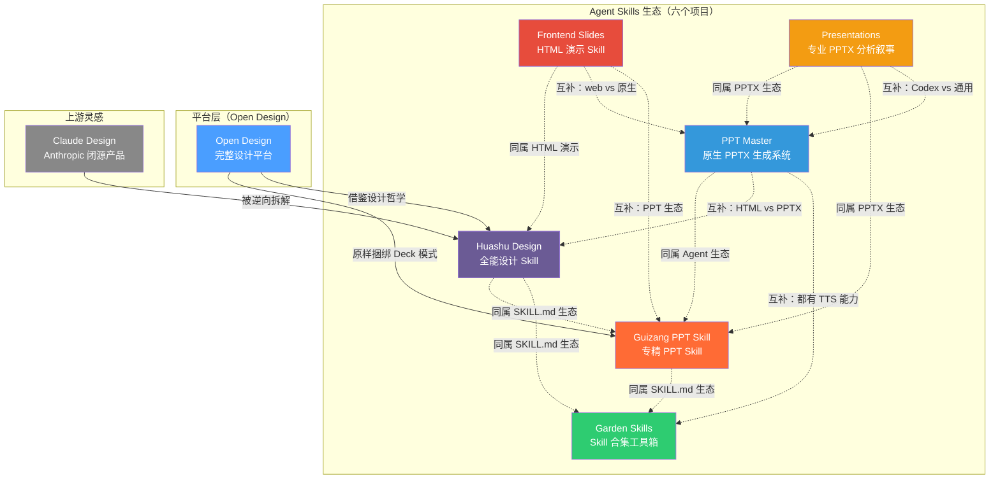

# 六个 Agent Design Skill 项目对比分析

> 对比对象：[Huashu Design](huashu-design-master/) · [Guizang PPT Skill](guizang-ppt-skill/) · [Garden Skills](garden-skills/) · [PPT Master](ppt-master-main/) · [Frontend Slides](frontend-slides/) · [Presentations](Presentations_zh.md)
>
> 补充说明：[Open Design](open-design-main/) 是一个完整的设计平台，而非单纯的 Skill，因此单独说明其与六者的关系，不参与直接对比。

***

## 一、项目定位

| 维度 | Huashu Design | Guizang PPT Skill | Garden Skills | PPT Master | Frontend Slides | Presentations |
|------|---------------|-------------------|---------------|------------|-----------------|---------------|
| **定位** | 全能设计 Skill —— 打字回车，拿到能交付的设计 | 专注于网页 PPT 生成的 Skill | Agent Skills 合集工具箱 | AI 原生 PPTX 生成系统 —— SVG→真 PPTX，Python 后端驱动 | HTML 演示文稿生成 Skill ——"展示，而非描述" | 专业级 PPTX 演示文稿 ——"严肃、高水准，干净远远不够" |
| **形态** | 纯 Skill（一个文件夹，跑在 Agent 里） | 纯 Skill（一个文件夹，跑在 Agent 里） | Skill 集合（4 个独立 Skill） | 混合式（SKILL.md + Python 脚本仓库 + SVG 模板库） | 纯 Skill + Claude Code 插件（SKILL.md + style presets + bold templates） | 纯 Skill 文件（SKILL.md），依赖 Codex 运行时 `@oai/artifact-tool` |
| **一句话** | "80 分的 skill，比 100 分的产品好用" | "克制优于炫技" —— 最专业的 PPT Skill | "Skill 超市，按需挑选" | "这是一份真正的 PPT —— 每个元素都能在 PowerPoint 里直接改" | "零依赖 HTML 演示 + 视觉风格探索 —— 看预览再做决定" | "可编辑的 PPTX，像由出色编辑、分析师和设计师共同打造" |
| **作者** | 花生（花叔）[@AlchainHust](https://x.com/AlchainHust) | 歸藏 [@op7418](https://x.com/op7418) | 花园老师 [@ConardLi](https://github.com/ConardLi) | 何雨果（Hugo He）[@hugohe3](https://github.com/hugohe3) | zara（扎扎）[@zarazhangrui](https://github.com/zarazhangrui) | OpenAI / Codex 官方生态 |
| **开源协议** | MIT | AGPL-3.0 | MIT | MIT | MIT | 未明确标注（Codex 生态内置） |
| **GitHub Stars** | ~12k+ | ~3k+ | ~4k+ | ~3k+ | ~1k+ | N/A（Codex 生态官方 Skill） |

***

## 二、核心能力对比

### 2.1 设计产出能力

| 产出类型 | Huashu Design | Guizang PPT Skill | Garden Skills | PPT Master | Frontend Slides | Presentations |
|----------|---------------|-------------------|---------------|------------|-----------------|---------------|
| **Web/App 原型** | ✅ 单文件 HTML + 真 iPhone 边框 | ❌ 不在此范围 | ✅ `web-design-engineer` 覆盖 | ❌ 不在此范围（专注 PPTX） | ❌ 不在此范围（专注 HTML 演示） | ❌ 不在此范围（专注 PPTX 分析叙事） |
| **HTML 幻灯片/PPT** | ✅ HTML deck + **可编辑 PPTX** | ✅ **核心能力**——22 种锁定版式 | ✅ `web-video-presentation` 覆盖 | ❌ 不做 HTML，直接生成**原生 PPTX**（DrawingML 形状/文本框/图表） | ✅ **核心能力**——单文件 HTML，零依赖，动画丰富，16:9 固定舞台 | ❌ 不做 HTML，仅通过 artifact-tool 生成**原生可编辑 PPTX** |
| **动画/视频** | ✅ **强项**——Stage+Sprite 引擎 + MP4/GIF/BGM | ❌ 仅 WebGL hero 页（B 键可关） | ✅ `web-video-presentation` 录屏视频 + TTS | ✅ PPT 原生转场+入场动画 + **TTS 音频旁白合成嵌入 PPTX** | ✅ CSS 动画 + JS 微交互 + 逐页揭示；低密度演讲模式/高密度阅读模式 | ✅ PPT 原生动画 + 逐页渐进揭示；不支持视频/TTS |
| **信息图/数据可视化** | ✅ 杂志级排版 + PDF/PNG/SVG | ❌ 配图用 GPT-Image 生成 | ✅ `gpt-image-2` 覆盖 | ✅ **40+ 图表 SVG 模板**（甘特图、桑基图、雷达图、矩阵图等） | ❌ 无专业图表库，靠 CSS 形状和排版 | ✅ **结构化视觉精度契约**——图表/连接器/框语法严格定义，主张+证明对象驱动 |
| **图像生成** | ✅ 脚本出图 | ✅ Codex 可选配图 | ✅ `gpt-image-2` Skill（79 模板） | ✅ 双路径：AI 生图（gpt-image-2 等多后端）+ 网络图片搜索（Pexels/Pixabay） | ❌ 无图像生成能力；可引用用户自带图片 | ✅ Codex imagegen 工具（仅编写提示文件，不直接调用外部 API） |
| **设计评审** | ✅ **5 维专家评审** + 雷达图 + Keep/Fix/Quick Wins 清单 | ❌ 仅 checklist 自检 | ❌ 无专门评审机制 | ⚠️ visual-review 工作流（按需执行，非主流程默认） | ❌ 无专门评审机制；"Show, Don't Tell" 风格选择代替抽象评审 | ✅ **联系表测试 + 改进评分标准 + QA 循环**——10 步强制工作流包含评分和最弱幻灯片迭代 |
| **品牌/设计系统** | ✅ 20 种设计语汇 + 5 步品牌协议 | ✅ 9 套预设主题色（不可自定义） | ✅ 25 套风格配方 | ✅ 品牌预设索引 + 布局模板 + 整 deck 模板 + 自定义模板注册 | ✅ **12 套预设主题**（6 深色 + 4 浅色 + 2 特色）+ **34 个大胆模板**（来自 beautiful-html-templates） | ✅ **8 种 deck-profile**（finance-ir / product-platform / gtm-growth 等）+ 设计系统锁定 + 品牌真实性门槛 |

### 2.2 能力矩阵图

```
                     原型/Web
                       ▲
                       │  ● Huashu
                       │
             幻灯片 ────┼──── 动画/视频
              ●     ●   │     ●   ●
            Frontend  PPT      PPT Master
            Slides   Master   (音频旁白)
              ●       │
          Presentations│
             (分析叙事) │
            信息图 ◄───┼───► 图像生成
                       │
                       │  ● Garden (设计)
             设计评审 ──┼──── 品牌系统
                   ●   │
             Presentations     ● Guizang (幻灯片)
             (10步QA循环)
```

| 项目 | 专长领域 | 一句话总结 |
|------|---------|-----------|
| **Huashu Design** | 原型 + 动画 + 评审 | 全能型，覆盖面最广，动画能力和设计评审是独有优势 |
| **Guizang PPT Skill** | 幻灯片 + 配图 | 专精型，PPT 领域最专业，两种视觉体系 + 版式校验 |
| **Garden Skills** | 视频 + 设计 + 图像 + 检索 | 工具箱型，4 个 skill 各管一摊，没有明显的弱项短板 |
| **PPT Master** | 原生 PPTX + 图表 + 音频旁白 | 工程型，唯一产出真原生 PPTX，Python 后端驱动，7 种源文件直接输入 |
| **Frontend Slides** | HTML 演示 + 风格探索 + 零依赖 | 前端型，唯一产出零依赖 HTML 演示，视觉风格探索 + PPT 转换 + 大胆模板库 |
| **Presentations** | 专业级 PPTX + 分析叙事 + 精度契约 | 分析型，产出最严谨的分析叙事 PPTX，8 种 deck-profile + 结构化视觉精度 + 10 步工作流 |

***

## 三、设计哲学与质量保障

| 维度 | Huashu Design | Guizang PPT Skill | Garden Skills | PPT Master | Frontend Slides | Presentations |
|------|---------------|-------------------|---------------|------------|-----------------|---------------|
| **设计起源** | 逆向 Claude Design 系统提示词 + 作者自创 | 歸藏线下"一人公司"分享沉淀 | 花园老师的设计工程实践经验 | 投融资从业者实际工作中审阅和修改 PPT 的需求驱动 | 让非设计师通过视觉探索发现自己偏好的教学式设计理念 | OpenAI / Codex 官方开发，面向分析叙事、投资者/运营回顾的高水准演示 |
| **反 AI slop 机制** | ✅ 紫渐变 / emoji 图标 / 圆角左 border / Inter display / SVG 人脸 全禁 | ✅ Style B 无圆角无渐变无阴影；不允许自定义色值 | ✅ 反 AI 俗套清单 | ✅ **严格串行流水线纪律**（8 条全局规则）+ spec_lock 防上下文漂移 + 禁止脚本批量生成 SVG | ✅ **12 套精心策划风格**对抗 AI 流水化 + 反通用美学（再见紫渐变）+ 34 个大胆模板替代方案 | ✅ **"如果更换公司名后看起来像通用 SaaS 仪表板，请继续迭代"** + 拒绝"可用"输出 + 8 种专业 deck-profile 防止千篇一律 |
| **质量控制** | 5 维专家评审 + Junior Designer 工作流 | P0/P1/P2/P3 分级 checklist + `validate-swiss-deck.mjs` 版式校验器 | 硬 checkpoint + 六步设计工作流 | **Step 4 八项确认（BLOCKING 硬停止）** + visual-review 工作流 + SVG quality checker 脚本 | **3 风格预览对比选择** + 内容密度检查 + 溢出/重叠自动检测 | **10 步强制工作流**（确认模式→源提取→主张框架→设计系统→联系表→构建→预览→评分→迭代→导出）+ 评分最弱幻灯片循环 |
| **视觉系统** | 5 流派 × 20 种设计哲学 | Style A 电子杂志 × 电子墨水 + Style B 瑞士国际主义 | 23 套视频主题 + 25 套设计风格配方 | 自由设计主导 + 品牌预设 + **40+ 图表模板** + 布局模板 + 整 deck 模板 | **12 套预设主题**（Bold Signal / Electric Studio 等）+ **34 個大胆模板**（Neo-Grid Bold / Vellum / Sakura Chroma 等） | **8 种 deck-profile 动态路由**（finance-ir / product-platform / engineering-platform / consumer-retail 等）+ 每个 profile 有独立视觉密度和证明对象规则 |
| **品牌策略** | **5 步品牌资产协议**（最严谨）：问→搜→下载→grep→固化 | 预设主题色保护：「保护美学比给自由更重要」 | 风格配方体系，有 anchor 的设计参考 | 品牌预设索引（brands_index.json）+ 自定义模板注册工作流 | 视觉预览驱动的风格发现 —— 不预设品牌，从预览中选择方向 | **品牌真实性门槛**——不得从头绘制/近似公司徽标；需验证来源资产；模板跟随模式继承源视觉系统 |
| **检验方式** | 最终 5 维雷达图评分 | 脚本自动校验版式合规 | checkpoint 逐步确认 | **spec_lock 逐页校验** + SVG quality checker 脚本 | 预览自动打开让用户直观对比选择；生成后检查溢出/重叠 | **联系表测试**——缩略图下检查视觉系统连贯性；可读大小下检查每页是否有主张+证明+无填充内容 |

### 六者的质量控制哲学

- **Huashu Design** 的 Junior Designer 工作流要求**尽早 show**：先列 assumptions + placeholders，让用户确认方向再深入。理解错了早改比晚改便宜 100 倍。
- **Guizang PPT Skill** 依靠**硬约束**：Style B 的 22 种锁定版式是白名单，agent 不能临时发明页面结构，校验脚本直接拦截违规输出。
- **Garden Skills** 的 `web-design-engineer` 使用**六步工作流**约束 agent 行为：需求→上下文→设计系统→v0→完整构建→验证，每一步都是 checkpoint。
- **PPT Master** 依靠**逐页强制校验 + 串行纪律**：spec\_lock 文件在每页生成前被重新读取，所有颜色/字体/图标必须来自该文件而非记忆；8 条全局执行纪律是最高优先级规则，违反即视为执行失败。
- **Frontend Slides** 依靠**渐进式披露 + "展示而非描述"**：先用小尺寸 preview\.md 卡片展示风格，用户选定后才读取完整 design.md；3 个视觉预览同时展示让用户直观对比，减少抽象决策。
- **Presentations** 依靠**主张框架 + 联系表测试 + 10 步闭环**：设计之前必须写 claim-spine.txt（每个非附录幻灯片须有 kicker + claim + proof + support note）；联系表测试是硬性门槛；10 步强制工作流包含评分和最弱幻灯片迭代，只有通过 QA 门槛才能导出。

***

## 四、技术架构

| 维度 | Huashu Design | Guizang PPT Skill | Garden Skills | PPT Master | Frontend Slides | Presentations |
|------|---------------|-------------------|---------------|------------|-----------------|---------------|
| **形态** | 一个文件夹（SKILL.md + assets + references + scripts + demos） | 一个文件夹（SKILL.md + assets + references + scripts） | 4 个独立文件夹，各自 SKILL.md | **仓库级混合项目**（SKILL.md + Python 脚本体系 + SVG 模板库 + references） | 单文件夹 + Claude Code 插件（SKILL.md + 12 presets + 34 bold templates + 脚本） | **单 SKILL.md 文件**（无额外文件夹结构；依赖 Codex 运行时 `@oai/artifact-tool`） |
| **产物框架** | 纯 HTML/CSS/JSX（无框架依赖） | 纯 HTML/CSS/JS | Vite + React + TypeScript（视频 skill） | **Native PPTX（DrawingML）+ SVG 中间格式** | **纯 HTML/CSS/JS，零依赖**（单文件，内联样式和脚本） | **artifact-tool presentation JSX**（Codex 运行时编译为原生 PPTX） |
| **后端依赖** | 无（全靠 Agent CLI + 浏览器） | 无（全靠 Agent CLI + 浏览器） | 无（全靠 Agent CLI + 浏览器） | ✅ **Python 3.10+ 必需**，`pip install -r requirements.txt`（核心运行时） | 无（全靠 Agent CLI + 浏览器）；脚本辅助 PPT 转换（extract-pptx.py） | ✅ **Codex CLI 运行时必需**（提供 `@oai/artifact-tool` v2.7.3+）；不支持其他 Agent |
| **安装方式** | `npx skills add alchaincyf/huashu-design` | `npx skills add op7418/guizang-ppt-skill` | `npx skills add ConardLi/garden-skills` | `git clone` + `pip install -r requirements.txt`；也支持 `npx skills add hugohe3/ppt-master` | `/plugin marketplace add https://github.com/zarazhangrui/frontend-slides` + `/plugin install`；或 `git clone` | Codex CLI 内置（随 Codex 运行时分发）或手动复制 SKILL.md |
| **安装复杂度** | ⭐⭐⭐⭐⭐ 极低 | ⭐⭐⭐⭐⭐ 极低 | ⭐⭐⭐⭐⭐ 极低 | ⭐⭐⭐ 中等（需 Python 环境 + 依赖安装） | ⭐⭐⭐⭐⭐ 极低（Claude Code 插件一键安装） | ⭐⭐⭐⭐ 低（需 Codex CLI 环境） |
| **支持的 Agent** | 所有 skill 兼容 agent | Claude Code / Codex / Cursor | Claude Code / Cursor / Codex | Claude Code / Cursor / Trae / Copilot / Codex / Windsurf 等 | Claude Code（官方插件）；其他 agent 可读 SKILL.md 使用 | **仅 Codex CLI**（强绑定 `@oai/artifact-tool` 运行时） |
| **运行模式** | `npx skills add` → 安装 → 对话中直接触发 | `npx skills add` → 安装 → 对话中直接触发 | `npx skills add` → 安装 → 对话中直接触发 | 对话触发 + **Python 脚本执行**（source_to_md / svg_to_pptx / image_gen 等） | 对话触发 → 生成 3 风格预览 → 用户选择 → 生成完整 HTML | 对话触发 → **10 步强制工作流**（profile 路由 → claim spine → 设计系统 → 联系表 → ESM 模块构建 → 评分迭代 → 导出） |

### Skill 文件夹结构对比

```
Huashu Design                    Guizang PPT                    Garden Skills (4个)              PPT Master (仓库级)              Frontend Slides                  Presentations
                                                                                                                                                              
huashu-design/                   guizang-ppt-skill/             garden-skills/                   ppt-master/                     frontend-slides/                 Presentations_zh.md
├── SKILL.md                     ├── SKILL.md                   ├── skills/                      ├── skills/                     ├── SKILL.md                     (单文件SKILL.md)
├── README.md                    ├── README.md                  │   ├── web-video-presentation/   │   └── ppt-master/             ├── README.zh.md                 依赖 Codex 运行时
├── assets/                      ├── assets/                    │   │   ├── SKILL.md              │       ├── SKILL.md            ├── STYLE_PRESETS.md              `@oai/artifact-tool`
│   ├── animations.jsx           │   ├── template.html          │   │   └── ...                   │       ├── workflows/ (9个)     ├── viewport-base.css             无独立文件结构
│   ├── ios_frame.jsx            │   ├── template-swiss.html    │   ├── web-design-engineer/      │       │   ├── ...              ├── html-template.md
│   ├── deck_stage.js            │   └── screenshot-backgrounds/│   │   ├── SKILL.md              │       ├── references/ (20+)   ├── animation-patterns.md
│   └── showcases/               ├── scripts/                   │   │   └── ...                   │       ├── scripts/ (Python)   ├── bold-template-pack/
├── references/                  │   └── validate-swiss-deck.mjs├── gpt-image-2/                  │       ├── templates/          │   ├── selection-index.json
│   ├── design-styles.md         ├── references/                │   │   ├── SKILL.md              │       └── .env.example        │   ├── templates/ (34个)
│   ├── critique-guide.md        │   ├── layouts.md             │   │   └── ...                   ├── docs/                       │   │   ├── neo-grid-bold/
│   └── ...                      │   ├── layouts-swiss.md       └── kb-retriever/                 ├── examples/                   │   │   ├── vellum/
├── scripts/                     │   ├── themes.md                  ├── SKILL.md              ├── README.md / README_CN.md      │   │   ├── sakura-chroma/
│   ├── render-video.js          │   ├── checklist.md               └── ...                   └── .env.example                  │   │   └── ...
│   ├── html2pptx.js             │   └── ...                                                                                     └── .claude-plugin/
│   └── ...                      └── README.md                                                                                       └── marketplace.json
└── demos/
```

***

## 五、适用场景速查

| 场景 | 推荐项目 | 理由 |
|------|---------|------|
| 我需要全能设计，从原型到动画到评审一条龙 | **Huashu Design** | 覆盖面最广，独有动画引擎和 5 维评审 |
| 我只做 PPT 演示文稿，要专业好看 | **Guizang PPT Skill** | 最专业，22 种锁定版式 + 两种视觉系统 + 校验脚本 |
| 我要做录屏式讲解视频，带 TTS 配音 | **Garden Skills** → `web-video-presentation` | 固定舞台 + 可插拔 TTS + 23 套主题 |
| 我需要 GPT-Image 2 图像生成，要模板库 | **Garden Skills** → `gpt-image-2` | 79 个结构化提示词模板 + 三种运行模式 |
| 我要一个懂设计判断的 Web 前端 Agent | **Garden Skills** → `web-design-engineer` | 25 套风格配方 + 六步工作流 |
| 我需要本地知识库检索 | **Garden Skills** → `kb-retriever` | 分层索引 + PDF/Excel 专项处理 |
| 我要做产品发布动画，导出 MP4/GIF | **Huashu Design** | Stage+Sprite 引擎 + BGM 合成 |
| 我要给公众号/小红书做封面图 | **Guizang PPT Skill** | 21:9 / 1:1 / 3:4 / 16:9 多平台封面 |
| 我要设计评审和迭代优化 | **Huashu Design** | 5 维专家评审 + Keep/Fix/Quick Wins 清单 |
| **我需要一份真正的、能在 PowerPoint 里逐元素编辑的 PPTX** | **PPT Master** | **唯一产出原生 DrawingML PPTX 的项目——每个文字框/形状/图表都能点开改** |
| **我需要从 PDF/Excel/网页/微信文章等直接生成 PPT** | **PPT Master** | 7 种源文件直接转换（PDF/DOCX/XLSX/PPTX/EPUB/URL/微信），无需手动整理 |
| **我需要 PPT 带 TTS 音频旁白，放映时自动朗读** | **PPT Master** | 唯一支持 TTS 音频旁白合成+嵌入 PPTX 的项目 |
| **我需要套用现有 PPTX 模板来生成新内容** | **PPT Master** | 唯一支持 template-fill 工作流——把你现有的 deck 当模板复用 |
| **我需要灵活的设计风格，不想被版式锁定** | **PPT Master** | 自由设计 + 品牌预设 + 40+ 图表模板，不限制创造力 |
| **我需要一个零依赖的 HTML 网页演示，能在浏览器直接打开** | **Frontend Slides** | **唯一产出单文件 HTML 演示的项目——无需构建、无需服务器、开箱即放** |
| **我不清楚设计偏好，需要看预览再做决定** | **Frontend Slides** | 独特"Show, Don't Tell"流程——生成 3 个视觉预览让你挑 |
| **我需要把我现有的 .pptx 转为网页演示** | **Frontend Slides** | PPT 转换模式——提取内容+图片，让你选择视觉风格后生成 HTML |
| **我要做演讲/路演/会议分享，需要视觉惊艳的网页演示** | **Frontend Slides** | 12 套预设主题 + 34 个大屏模板，动画丰富，支持低密度演讲模式 |
| **我需要制作投资者关系 / 收益 / 财务分析的 PPTX** | **Presentations** | **唯一拥有专门 finance-ir profile 的项目**——精确报告数据、单位规范、来源脚注、披露逻辑 |
| **我需要制作产品叙事 / SaaS 平台演示的 PPTX，含架构图和工作流图表** | **Presentations** | 专门的 product-platform profile + 结构化视觉精度契约 |
| **我需要精确克隆一个现有 PPTX 模板，保留源排版/调色板/布局** | **Presentations** | template-following 模式——导入→复制→就地编辑→导出，不重建 |
| **我需要高水准的分析叙事 PPTX，像专业分析师出品** | **Presentations** | 主张框架（claim spine）+ 联系表测试 + 10 步闭环工作流，拒绝"可用"输出 |
| 我不想选，全都要 | 六个都装 | 互不冲突，按需使用 |

***

## 六、生态关系



### 六者都是纯 Skill 的共同特征

- 都遵循 `SKILL.md` 规范，安装方式统一（`npx skills add ...`）
- **都不需要启动服务**，安装即用，对话触发（PPT Master 额外需要 Python 环境；Presentations 需要 Codex CLI 运行时）
- **都不依赖特定 Agent CLI**，只要 Agent 支持 skill 规范就能跑（Presentations 除外，仅限 Codex CLI）
- **都不收取额外费用**，只消耗用户自己的 API 额度
- **都可以同时安装**，互不冲突

***

## 七、综合评估

| 对比项 | Huashu Design | Guizang PPT Skill | Garden Skills | PPT Master | Frontend Slides | Presentations |
|--------|---------------|-------------------|---------------|------------|-----------------|---------------|
| **功能广度** | ⭐⭐⭐⭐⭐ 全能 | ⭐⭐⭐ 聚焦 | ⭐⭐⭐⭐⭐ 4 个 skill 覆盖 | ⭐⭐⭐⭐ 专精 PPT 全链路 | ⭐⭐⭐ 聚焦 HTML 演示 | ⭐⭐⭐⭐ 专业级 PPTX 全场景（8 种 profile 覆盖） |
| **专精度** | ⭐⭐⭐⭐ | ⭐⭐⭐⭐⭐ PPT 领域极致 | ⭐⭐⭐⭐ 各 skill 各有深度 | ⭐⭐⭐⭐⭐ 原生 PPTX 独一无二 | ⭐⭐⭐⭐⭐ HTML 演示独一无二 | ⭐⭐⭐⭐⭐ 分析叙事 PPTX 独一无二 |
| **易上手** | ⭐⭐⭐⭐⭐ 一句话安装 | ⭐⭐⭐⭐⭐ 一句话安装 | ⭐⭐⭐⭐⭐ 一句话安装 | ⭐⭐⭐ 需 Python 环境 + 依赖安装 | ⭐⭐⭐⭐⭐ Claude Code 插件一键安装 | ⭐⭐⭐⭐ 需 Codex CLI 环境 |
| **设计质量** | ⭐⭐⭐⭐⭐ 品牌协议最严谨 | ⭐⭐⭐⭐⭐ 锁定版式保底线 | ⭐⭐⭐⭐ 风格配方有 anchor | ⭐⭐⭐⭐ spec_lock 强制约束保一致性 | ⭐⭐⭐⭐ 46 套精心设计风格模板保证高起点 | ⭐⭐⭐⭐⭐ 主张框架 + 联系表测试 + 精度契约保证专业水准 |
| **独有能力** | 动画引擎 + 5 维评审 | 瑞士风校验 + 22 版式锁定 | TTS 视频 + GPT-Image 模板库 | **原生 PPTX 导出 + TTS 音频旁白 + template-fill + 7 种源文件输入** | **零依赖单文件 HTML + Show Don't Tell 风格探索 + PPT 转网页** | **8 种 deck-profile 路由 + 主张框架 + 结构化视觉精度契约 + 模板精确克隆** |
| **维护活跃** | ⭐⭐⭐⭐ | ⭐⭐⭐ | ⭐⭐⭐⭐ | ⭐⭐⭐⭐⭐ 持续更新 | ⭐⭐⭐⭐ | ⭐⭐⭐（Codex 生态更新节奏） |
| **文档质量** | ⭐⭐⭐⭐⭐ Demo 多 | ⭐⭐⭐⭐⭐ 极细致 | ⭐⭐⭐⭐⭐ 图文并茂 | ⭐⭐⭐⭐⭐ 中英双语 + 快速入门 + 常见问题 + 示例工程丰富 | ⭐⭐⭐⭐⭐ 中英双语 + 画廊 + 插件安装指南 | ⭐⭐⭐⭐ 详细的工作流说明 + profile 文档 |

### 选型速查

| 你的角色 | 推荐 |
|---------|------|
| **独立开发者**，各种设计需求都有 | 先装 **Huashu Design**，覆盖面最广 |
| **内容创作者 / 自媒体**，频繁做 PPT 和封面 | **Guizang PPT Skill** 是首选 |
| **产品 / 技术人**，要录视频、出图、写设计稿 | **Garden Skills** 工具箱按需取用 |
| **商务 / 学术 / 投融资**，需要真 PPTX 交付物 | **PPT Master**——唯一产出原生可编辑 PPTX |
| **培训 / 教育工作者**，需要 PPT 带音频旁白自动播放 | **PPT Master**——唯一支持 TTS 音频嵌入 |
| **演讲 / 路演 / 会议分享**，需要视觉惊艳的网页演示 | **Frontend Slides**——零依赖 HTML，动画丰富，3 预览选风格 |
| **不确定设计偏好，想先看效果再决定** | **Frontend Slides**——独有的"Show, Don't Tell"预览流程 |
| **金融 / 投行 / 分析师**，需要严谨的分析叙事 PPTX | **Presentations**——唯一拥有 finance-ir profile + 主张框架的项目 |
| **产品 / SaaS 团队**，需要精确的产品演示 + 架构图 PPTX | **Presentations**——product-platform profile + 结构化视觉精度契约 |
| **成年人**，不想做选择 | 六个都装，互不冲突，对话里按需触发 |

***

## 附：Open Design 是什么，它和这六个项目什么关系

**Open Design** 不是一个 Skill，而是一个**完整的设计平台**——它有 Web UI（Next.js）、有本地 Daemon（Node.js）、有 SQLite 持久化、有 150 套 Design System、有 16 种 Agent CLI 检测机制，以及完整的项目管理和对话管理。

它和六个 Skill 项目的关系：

1. **它捆绑了 Guizang PPT Skill** —— Open Design 的 Deck 模式直接使用了歸藏的 `guizang-ppt` 作为实现
2. **它借鉴了 Huashu Design 的设计哲学** —— 品牌资产协议、反 AI slop 清单、5 维自我审查等核心设计理念都源自花生
3. **它与 Garden Skills 无直接依赖** —— 但 Garden 的 `web-design-engineer` 和 Open Design 的设计方向顾问思路有异曲同工之处
4. **它未直接引用 PPT Master** —— 但两者在产品理念上互补：Open Design 侧重平台化 UI 设计，PPT Master 专精于高性能 PPTX 生成
5. **它与 Frontend Slides 无直接依赖** —— 但两者都以 HTML 演示为输出形态，方向相近但实现不同
6. **它与 Presentations 无直接依赖** —— 但 Presentations 为 Codex 原生生态的官方 Skill，Open Design 作为跨 Agent 平台可选用任何 Skill 作为底层

简单来说：**六个 Skill 是"零件"，Open Design 是"组装好的机器"**。如果你想要开箱即用的设计平台 + UI 界面，选 Open Design；如果你在终端里用 Agent 干活，六个 Skill 更轻更快。
